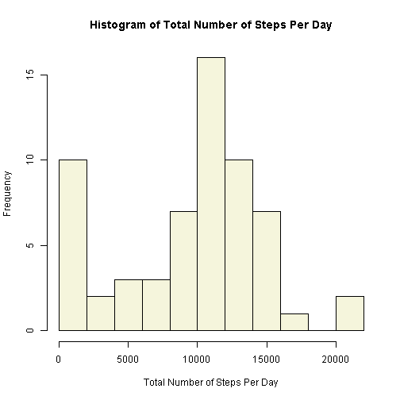
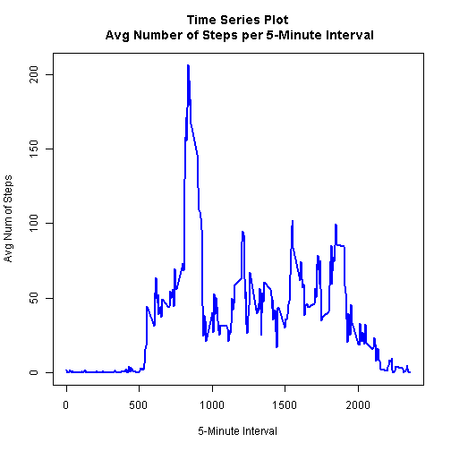
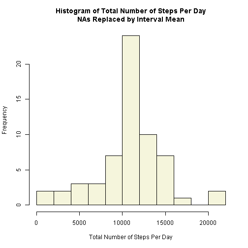
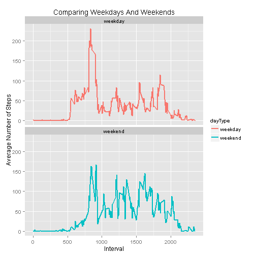

# Reproducible Research: Peer Assessment 1  
### January 6, 2016  
  
### Loading and preprocessing the data
 Show any code that is needed to  
 1.	Load the data (i.e. read.csv())  
 2.	Process/transform the data (if necessary) into a format suitable for your analysis  

Load the activity data into R

```r
 activity <- read.csv("activity.csv", stringsAsFactors=FALSE)
```
Change the date variable type from character to Date 

```r
 activity$date <- as.Date(activity$date)
 str(activity)
```

```
## 'data.frame':	17568 obs. of  3 variables:
##  $ steps   : int  NA NA NA NA NA NA NA NA NA NA ...
##  $ date    : Date, format: "2012-10-01" "2012-10-01" ...
##  $ interval: int  0 5 10 15 20 25 30 35 40 45 ...
```
### What is mean total number of steps taken per day?
 For this part of the assignment, you can ignore the missing values in the dataset.  
 1.	Calculate the total number of steps taken per day  
 2.	If you do not understand the difference between a histogram and a barplot, research the difference between them.  Make a histogram of the total number of steps taken each day  
3.	Calculate and report the mean and median of the total number of steps taken per day  

 Employing the aggregate function to calculate the total number of steps taken per day.  


```r
 aggdata <-aggregate(activity$steps, by=list(activity$date), FUN=sum, na.rm=TRUE)
```
And adding the new variable names to the new data frame.  

```r
 names(aggdata) <- c("day", "totalSteps")
 head(aggdata)
```

```
##          day totalSteps
## 1 2012-10-01          0
## 2 2012-10-02        126
## 3 2012-10-03      11352
## 4 2012-10-04      12116
## 5 2012-10-05      13294
## 6 2012-10-06      15420
```
The histogram, for the total number of steps taken each day is as follows:  

```r
 hist(aggdata$totalSteps, breaks=10,
      main="Histogram of Total Number of Steps Per Day",
      col="beige", 
      xlab="Total Number of Steps Per Day")
```

 
  
The mean and median of the total number of steps taken per day are as follows:  

```r
 mean(aggdata$totalSteps)
```

```
## [1] 9354.23
```

```r
 median(aggdata$totalSteps)
```

```
## [1] 10395
```
  
### What is the average daily activity pattern?
1.	Make a time series plot (i.e. type = "l") of the 5-minute interval (x-axis) and the average number of steps taken, averaged across all days (y-axis)  
2.	Which 5-minute interval, on average across all the days in the dataset, contains the maximum number of steps?  

The average number of steps taken, averaged across all days is as follows:  

```r
 timeSeries <- aggregate(steps ~ interval, data=activity, FUN=mean, na.rm=TRUE)
 str(timeSeries)
```

```
## 'data.frame':	288 obs. of  2 variables:
##  $ interval: int  0 5 10 15 20 25 30 35 40 45 ...
##  $ steps   : num  1.717 0.3396 0.1321 0.1509 0.0755 ...
```

```r
 head(timeSeries)
```

```
##   interval     steps
## 1        0 1.7169811
## 2        5 0.3396226
## 3       10 0.1320755
## 4       15 0.1509434
## 5       20 0.0754717
## 6       25 2.0943396
```
A time series plot (i.e. type = "l") of the 5-minute interval is as follows:  

```r
 plot(timeSeries$interval, timeSeries$steps, type="l", col="blue", lwd=2,
        main = "Time Series Plot\n Avg Number of Steps per 5-Minute Interval",
        xlab = "5-Minute Interval",
        ylab = "Avg Num of Steps")
```

 

The 5-minute interval, across all the days in the dataset, that contains the maximum number of steps is the following:  

```r
 timeSeries[timeSeries$steps==max(timeSeries$steps),]
```

```
##     interval    steps
## 104      835 206.1698
```
  
### Imputing missing values
Note that there are a number of days/intervals where there are missing values (coded as NA). The presence of missing days may introduce bias into some calculations or summaries of the data.  
1.	Calculate and report the total number of missing values in the dataset (i.e. the total number of rows with NAs)  
2.	Devise a strategy for filling in all of the missing values in the dataset. The strategy does not need to be sophisticated. For example, you could use the mean/median for that day, or the mean for that 5-minute interval, etc.  
3.	Create a new dataset that is equal to the original dataset but with the missing data filled in.  
4.	Make a histogram of the total number of steps taken each day and Calculate and report the mean and median total number of steps taken per day. Do these values differ from the estimates from the first part of the assignment? What is the impact of imputing missing data on the estimates of the total daily number of steps?  

The total number of missing values in the dataset is as follows:  

```r
 sum(is.na(activity$steps))
```

```
## [1] 2304
```
  
In this paper, the strategy for filling in all of the missing values in the dataset is:  
1.  Make a copy of the activity dataframe and call the copy newData.  
2.  Iterate through the activity data frame while replacing the NAs with the mean for the 5-minute intervals in the newData data frame.  
3.  The new data frame, newData is equal to the original dataset but with the missing data filled in.  


```r
 newData <- activity

  for (i in 1:nrow(activity)) {
   if (is.na(activity$steps[i])) {
       k <- activity$interval[i]
       m <- timeSeries[match(k, timeSeries$interval), 2]
       newData$steps[i] <- m
    }
 }
```
The new histogram for newData for the total number of steps taken each day - after aggregating the data and naming the new columns - is as follows:  

```r
 aggNew <- aggregate(newData$steps, by=list(newData$date), FUN=sum, na.rm=TRUE)
 names(aggNew) <- c("day", "totalSteps")

 hist(aggNew$totalSteps, breaks=10,
      main="Histogram of Total Number of Steps Per Day\nNAs Replaced by Interval Mean",
      col="beige", 
      xlab="Total Number of Steps Per Day")
```

 
  
The mean and median of the total number of steps taken per day - with the NA values replaced with the mean values of the respective 5-minute interval - are as follows:  

```r
 mean(aggNew$totalSteps)
```

```
## [1] 10766.19
```

```r
 median(aggNew$totalSteps)
```

```
## [1] 10766.19
```
Compared to the mean and median obtained earlier with the NA values present the new values differ significantly.  By replacing the NA values with the mean values of the respective 5-minute interval, the new mean and median values are much higher.  
  
### Are there differences in activity patterns between weekdays and weekends?
For this part the weekdays() function may be of some help here. Use the dataset with the filled-in missing values for this part.  
1.	Create a new factor variable in the dataset with two levels - "weekday" and "weekend" indicating whether a given date is a weekday or weekend day.  
2.	Make a panel plot containing a time series plot (i.e. type = "l") of the 5-minute interval (x-axis) and the average number of steps taken, averaged across all weekday days or weekend days (y-axis).  

Add a column (variable) named dayType in newData and call everything "weekday"  

```r
 newData$dayType <- c("weekday")
```
Identify Saturdays and Sundays in newData and replace "weekday" with "weekends" by iterating through the activity data frame while replacing "weekday" with "weekend" where appropriate in the newData data frame:  
 

```r
 for (i in 1:nrow(activity)){
  if (weekdays(activity$date[i]) == "Saturday" | weekdays(activity$date[i]) == "Sunday")
       newData$dayType[i] <- "weekend" 
}
```
Convert dayType to a factor  

```r
 newData$dayType <- as.factor(newData$dayType)
```
In order to make a panel plot containing a time series plot of the 5-minute interval (x-axis) and the average number of steps taken - averaged across all weekday days or weekend days (y-axis) - the aggregate function is used on newData by steps as a function of interval + dayType as follows:  

```r
 timeSeries2 <- aggregate(newData$steps ~ newData$interval + newData$dayType, newData, mean)
```
Add column names to timeSeries2  

```r
 names(timeSeries2) <- c("interval", "dayType", "steps")
 str(timeSeries2)
```

```
## 'data.frame':	576 obs. of  3 variables:
##  $ interval: int  0 5 10 15 20 25 30 35 40 45 ...
##  $ dayType : Factor w/ 2 levels "weekday","weekend": 1 1 1 1 1 1 1 1 1 1 ...
##  $ steps   : num  2.251 0.445 0.173 0.198 0.099 ...
```
And calling ggplot2 to draw the panel plot:  

```r
 library(ggplot2)

 ggplot(timeSeries2, aes(interval, steps, colour = dayType)) + 
      geom_path(aes(interval, steps, group=dayType)) +
      ggtitle("Comparing Weekdays And Weekends") +
      geom_line(aes(), size = 0.8) +
      xlab("Interval") + ylab("Average Number of Steps") +
      facet_wrap(~dayType, nrow=2)  
```

 
  
So, are there differences in activity patterns between weekdays and weekends?  The answer is yes - there is more activity, or a higher number of steps during the weekends than during the weekdays.  
